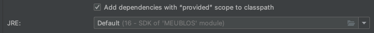

# MEUBLOS

[](https://lgtm.com/projects/g/AMT-21/sprint0/context:java)

MEUBLOS est un site e-commerce de meubles. Ce projet s'inscrit dans le cadre du sprint0 du cours d'AMT 2021, l'idée est de prendre en main les technologies comme Java EE Springboot, Thymeleaf. Le test de code automatique avec Travis, et l'intégration continue avec les GitHub Actions.

## Contribuer au projet

### Prérequis

1. Installer git-flow (voir https://github.com/AMT-21/sprint0/wiki/Convention-de-nommage#workflow)
2. Se renseigner sur les conventions de nommages utilisées dans ce projet : https://github.com/AMT-21/sprint0/wiki/Convention-de-nommage#java
3. Créer une issue sur le repo décrivant la fonctionnalité qui va être développée et pourquoi elle serait utile.

> TODO DPO - Un peu court ce README, non ? ;-)
> Il manque pas mal d'informations pour que je puisse commencer à dev en tant que nouveau développeur ou si je dois passer le projet
> à une autre équipe en tant que client. Il y a certaines questions qui devraient être répondue.
> * version java (hey oui, on l'oublie souvent celui-là...) ? 
> Un petit aperçu de la version qui s'affiche dans la config de mon IDE la 1ère fois que j'ai ouvert votre projet 
> D'ailleurs votre pom.xml est configuré pour java 8
> * Comment lancer le projet en local (connexion à une db, paramètres spéciaux, commandes maven, ...) ?
> * Y a-t-il d'autres fichiers ou un wiki pour la documentation (un petit lien, ça serait cool) ?


### Travailler sur le repo
1. Cloner le repo en local :
```
git clone https://github.com/AMT-21/sprint0
```
2. Créer une branch feature :
```
git flow feature start MYFEATURE 
```
3. Une fois la fonctionnalité développée, créer une PR sur la branch dev. Nous ferons notre maximum pour traiter vos modifications le plus rapidement possible.

## License
[MIT](https://choosealicense.com/licenses/mit/)

> TODO DPO - L'avancement est super et vous avez bien avancé sur les fonctionnalités. Mais je me rends compte en lisant le code que 
> ça a eu un coup sur certains points qu'on va améliorer avant d'aller plus loin. 
> Je vous ai mis quelques commentaires dans le code, mais je vous ferais une review live.
> 
> L'un des premiers points, c'est l'architecture du projet. 
> Je vous invite à effectuer un peu de recherche sur les interactions et le code qui devrait se trouver dans un contrôleur, service, repository, dao, dto, entités, mappers, ...
> Voici un peu de doc de pourquoi utiliser des services https://blog1.westagilelabs.com/why-to-use-service-layer-in-spring-mvc-5f4fc52643c0
> Passez du temps à refactor ce qui a été créer, car il y a du code et des appels de composants qui ne sont pas cohérents.
> Exemple: le contrôleur appel les repository alors que vous avez un service
> 
> le 2ème point (et c'est souvent le cas), la doc. Si vous effectuez un livrable, je fois pouvoir l'utiliser sans me devoir trop réfléchir
> à ce que je dois faire. Voir les commentaires plus haut pour le README et plus bas pour le WIKI. Je vous laisse complèter ces parties.
> 
> Enfin, il n'y a pas de tests unitaire ou d'intégration pour le moment. Avez-vous pu effectuer quelques recherches à ce propos ?
> Besoin de documentation ou avez-vous des questions à ce propos ?

> TODO DPO - Je vous mets les commentaires du wiki ici car je n'ai pas les droits de modifier votre wiki
> 
> Choix technologiques
> Vous utilisez java 8 sorti en 2014 et entre temps est sorti java 11 qui est une LTS sorti depuis 3 ans. Y a-t-il une raison à ne pas utiliser cette version ? https://www.oracle.com/java/technologies/java-se-support-roadmap.html
> La page est pauvre... Vous indiquez ce que vous avez choisi sans mentionner d'autres technologies existantes, sans compter ceux qui manquent 
> (framework, serveur, ORM ou pas, base de données, ...). Il serait bien d'étoffer cette partie afin que vous puissiez être au clair sur ce qui existe et que vous puissiez avoir une discussion si on vous pose la question
> même si votre argument final serait "Nous avons choisi ces technologies, car elles sont familières à l'ensemble de l'équipe" ou 
> "Nous les avons sélectionné, car elle nous intéresse".
> 
> Schéma et conception
> Aïe pas de diagramme de classe, de la base de données, de diagramme des payload, de diagramme de l'infra et/ou de diagramme de séquence. 
> Il va falloir ajouter cette partie.
> 
> Technologies pour l'interface utilisateur
> Vous avez utilisé un template ?
> 
> Bonne review et bonne continuation.
